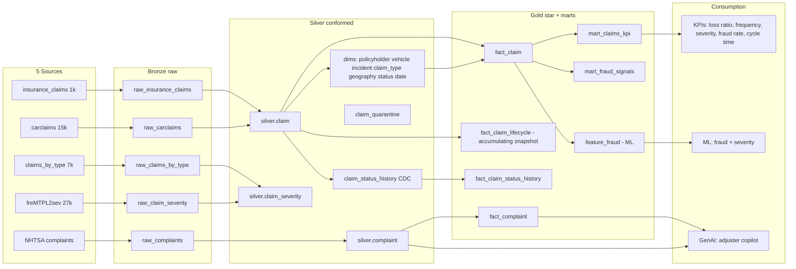

# Claims Domain — Architecture (LOCKED)

**Use case:** "Claims Intelligence & Fraud" — analytics + fraud + an adjuster copilot.
**Catalog:** `dev_claims` (prod: `prod_claims`). Medallion: bronze → silver → gold → ML/GenAI.

## End-to-end flow

## Silver (LOCKED)
- `silver.claim` — conform insurance_claims + carclaims into one claim grain (+ `source_system`, `fraud` flag, dedup, typed).
- `silver.claim_severity` — freMTPL2sev + Spanish by-type (claim amount + type, portfolio scale).
- `silver.complaint` — NHTSA narratives + crash/fire/injury flags; narrative text extracted for RAG.
- `silver.claim_status_history` — **derived** lifecycle (CDC): FNOL → under-review → approved/denied → settled → closed.
- `silver.claim_quarantine` — rows failing expectations.
- **Custom derivation logic (seeded, documented as synthetic):** `fnol_date`, `claim_status`,
  `settlement_date`, `cycle_time_days` from `incident_date` + severity + fraud + (carclaims timing fields).

## Gold — dimensions (LOCKED)
`dim_policyholder` (SCD2), `dim_vehicle` (SCD2), `dim_incident`, `dim_claim_type`, `dim_geography`,
`dim_claim_status`, `dim_date`.

## Gold — facts (LOCKED)
- `fact_claim` — grain: one claim. Measures: total/injury/property/vehicle amount, is_fraud, claim_count.
- `fact_claim_lifecycle` — **accumulating snapshot**: milestone dates + stage lags + cycle_time. Powers cycle-time KPIs.
- `fact_claim_status_history` — one row per status change.
- `fact_complaint` — one row per NHTSA complaint.

## Gold — marts & KPIs (LOCKED)
- `mart_claims_kpi`: loss ratio, claim frequency, severity, **fraud rate**, claim mix, component split, **avg cycle time, open vs closed, aging, denial rate**.
- `mart_fraud_signals`: fraud rate by make / severity / hobby / incident type.
- `feature_fraud`: ML feature table.

## ML & GenAI (later phases)
- **ML:** fraud classifier + severity predictor on `feature_fraud`.
- **GenAI:** Claims Adjuster Copilot — summarize claim, find similar, flag fraud, draft assessment; RAG over `silver.complaint`.

## Known gaps (handled in silver, documented)
1. Lifecycle status + dates are **derived/synthetic** (seeded).
2. carclaims has no money column → amounts null for those rows (fraud/categorical only).
3. True claim frequency needs policy exposure (cross-domain with UC Policy) — approximate until then.
